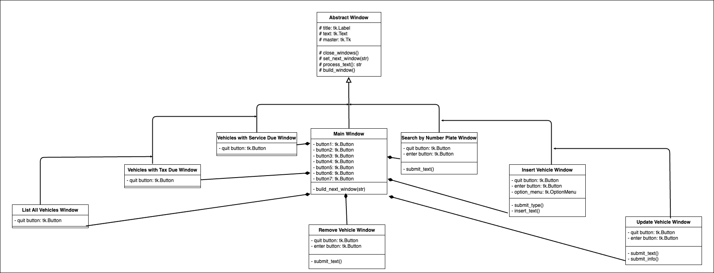

src package
===========

Module contents
---------------

.. automodule:: src
   :members:
   :undoc-members:
   :show-inheritance:

Subpackages
-----------

.. toctree::
   :maxdepth: 1

   src.tests
   src.utils

Submodules
----------

src.window\_classes module
--------------------------
This diagram outlines the design of the window classes
describing the inheritance and composition of them:

.. automodule:: src.window_classes
   :members:
   :undoc-members:
   :show-inheritance:

src.database\_setup module
--------------------------

.. automodule:: src.database_setup
   :members: 
   :undoc-members:
   :show-inheritance:

